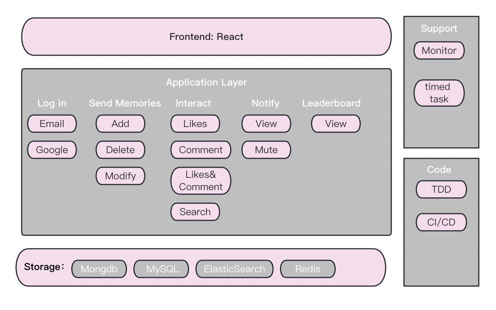

## About Social Media App
Implement a social media application: users can post text + pictures on the APP to show interesting things in life.

## Features
- Log in. Support login with Google account.
- Send memories. It can be modified and deleted later.
- View the memories sent by others, and search them.
- Recommendation and display of memories, ranking list (daily list, weekly list, etc.).
- Comments and likes for memories.
- Labels. Memories can be tagged and search based on tags is supported.
- System notifications. Likes, comments, announcements, etc. will send system notifications.

## Design Highlights
- Developed a full-stack Social Media APP using the **MERN** stack(**React**, **MongoDB**, **Express.js**, and **Node.js**), encompassing functionalities like posting, deleting, and engaging with memories through **REST**ful APIs.
- integrated **OAuth 2.0** for **Google** sign-in and **JWT** for email authentication, bolstering user security and experience.
- Optimized **MongoDB** queries with efficient indexing and pagination, resulting in a **46\%** reduction in query times, and enhanced system resilience against spikes and potential attacks using **express-rate-limit** and **mint-filter**.

## Project Structure

- Frontend: Client(React) 
- Backend: Server(Node)\
**Server**:
    - index.js: start up server
    - routes: routing
    - controllers: The handler used by routes. (Extract complex logic from routes)
    - models：Mongodb collection definition.\
**Client**:
    - react


## How To Start
- run ```npm i && npm start``` for both client and server side to start the app
